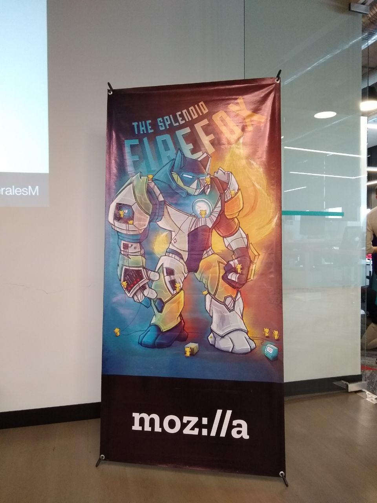
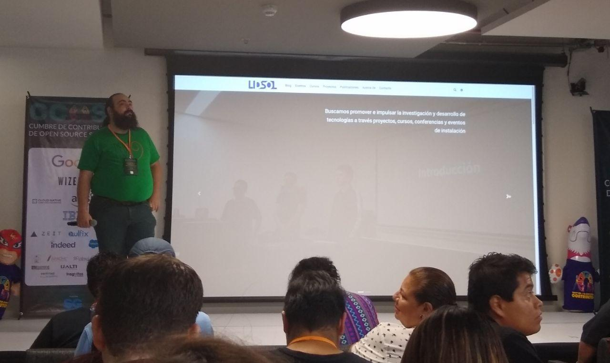
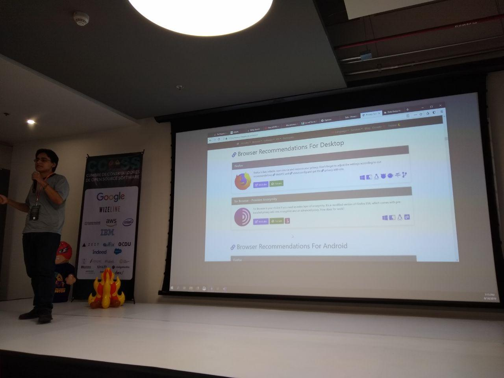

The LIDSOL team had the opportunity to be part of the Open Source Software Contributors Summit (CCOSS), which took place in Guadalajara, Jalisco from September 14 to 15. In this post, we want to share our experiences, insights, lessons learned, and behind-the-scenes moments.

## What is CCOSS?

CCOSS is an event focused on addressing the issue of contributions to open source projects. Even though the use of open source is
[widespread in Latin America](https://hipertextual.com/2015/04/politicas-de-software-libre-en-latinoamerica),
actual contributions remain minimal. To tackle this, the organizers brought together a large number of open source and free software communities from across the country.

Among the organizers were people from *[Software Guru](https://sg.com.mx/)*, *Google*,
*Wizeline*, *Helix Re*, and the *[Free Software Laboratory of Zacatecas](https://cozcyt.gob.mx/labsol/)*. From this alone, we could tell how significant the event was. There was an enriching atmosphere for the development of open source and free software in Mexico. We were especially glad to see many university students interested in the topic, which we find wonderful.

At LIDSOL, we believe that communities are a fundamental part of the ecosystem, and young blood is always beneficial. Especially considering the significant lag in the development of technologies aligned with these ideologies throughout Latin America.

As mentioned, the event lasted two days. The first day was entirely dedicated to talks by people who actively contribute to projects. We highlight the presence of Federico Mena (Co-founder of the GNOME project), Andréa Gómez (Go and Cloud developer), Jacobo Najera (May First Movement Technology), and Alejandro Calleja (Red Hat), among others.

## LIDSOL’s Presence at CCOSS

We attended various talks covering highly relevant topics such as the difference between open source and free software, projects being developed in different institutions, [the Tor network in Latin America](https://www.youtube.com/watch?v=EHp-BNL7UnE), the open source economy, intelligent robot development with ROS and AWS, and the state of open source in Latin America. Additionally, Gunnar Wolf spoke about the laboratory during the opening talks, where we briefly discussed the projects we are developing.

For example, the project on privacy and anonymity mechanisms, progress in managing the ACM chapter at UNAM, interns working on their theses in the lab, and past and future workshops delivered by LIDSOL members.

We attended the event with the intention of understanding the current state of contributions, meeting people interested in collaborating, and above all, learning new things. For that reason, we participated in several workshops, including CPython, TensorFlow, Firefox, and GNOME.

On the other hand, we had the opportunity to extend the first day’s agenda by hosting a privacy and anonymity panel. In it, we discussed the importance of privacy, how the TOR network works, and general advice for a healthier digital life.

## What Did We Learn?

We attended the second day’s workshops, where we were guided on how to contribute to different software projects and, above all, helped overcome the fear of submitting our first
*[pull request](https://help.github.com/en/articles/about-pull-requests)*.
Since the audience included students, academics, and professionals from various industries, most workshops covered fundamental concepts such as using the terminal, [GitHub](https://github.com/) to obtain projects, and [git](https://git-scm.com/) to contribute in the current standard way.

Below we share a general overview of the `CPython` workshop, which was one of the ones we attended. We also include the list of workshops we joined as a lab. If you would like to dive deeper into any of these tools, feel free to reach out to us.

### Workshop List

* GNOME
* Firefox
* TensorFlow

### CPython

The workshop began with a few prerequisites from the previous day. The organizers recommended obtaining the `CPython` source code, which is officially hosted in a
[GitHub repository](https://github.com/python/cpython). Downloading it requires basic knowledge of the
[git](https://git-scm.com/) tool. Once we had the source code, we explored the project’s folder structure and then proceeded to compile the source to create our own executable.

We were guided on the most beginner-friendly path to start contributing to the `CPython` source code. It was also mentioned that you do not need to be a developer to contribute. There are always `issues` related to documentation, localization (translation), and other topics that do not necessarily require a technical profile.

Finally, we reviewed different project needs on its [contribution page](https://bugs.python.org/), made some modifications to the source code, and submitted our *pull request :D*

## Conclusions

Without a doubt, we gained a very enriching experience at this event thanks to the diversity of perspectives, contexts, and people we were able to engage with. For the lab, it was a great opportunity to share our work with the CCOSS community and, at the same time, important for us to share with you all the knowledge we acquired.

We want to emphasize that if you are interested in contributing to any of the projects mentioned above—or to any other open source or free software project—you can reach out to LIDSOL. **We’re here to help you!!!**
