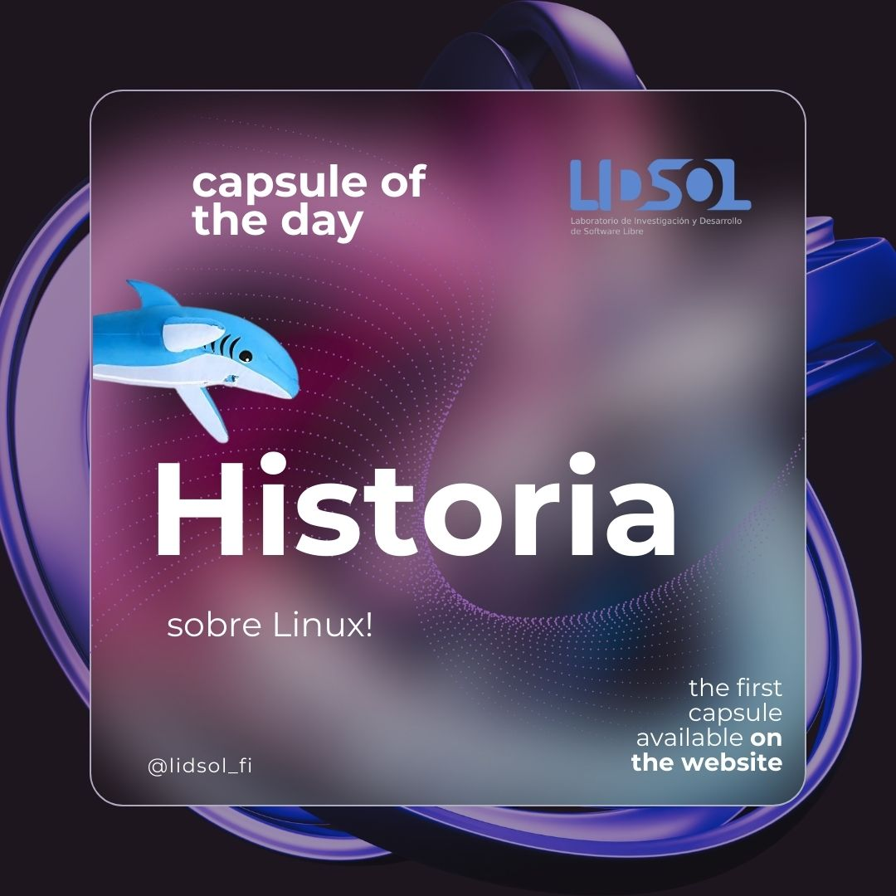
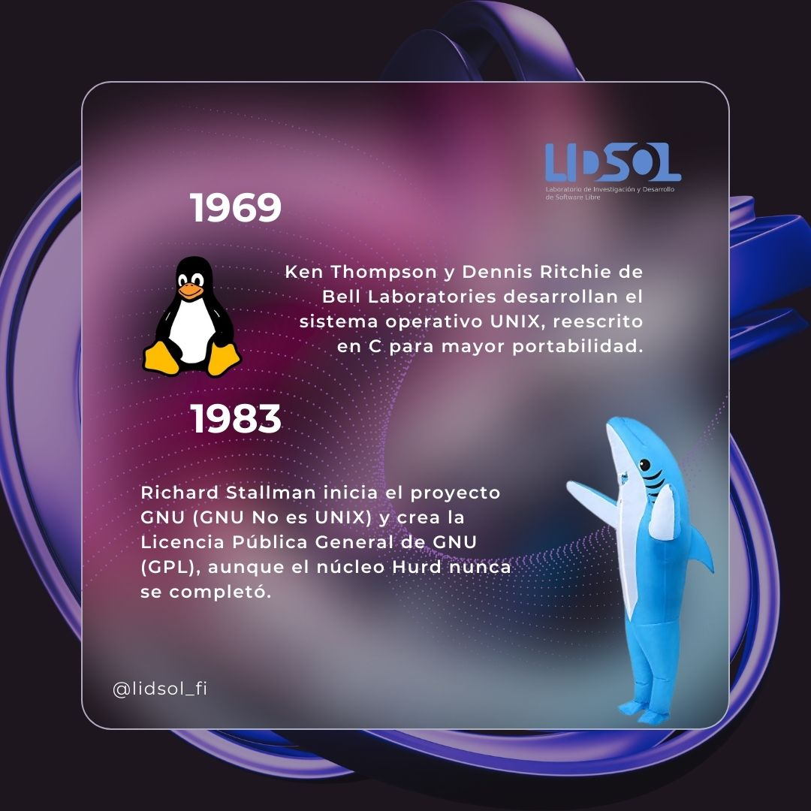
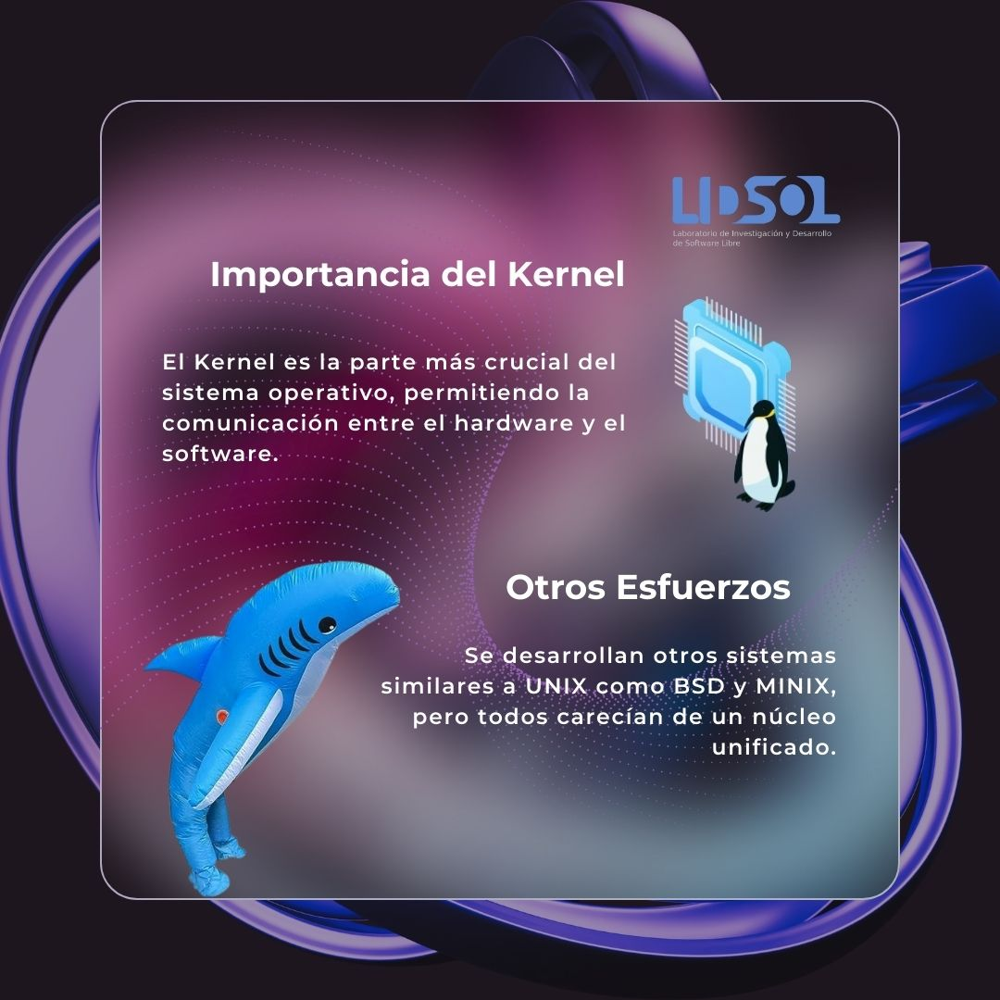
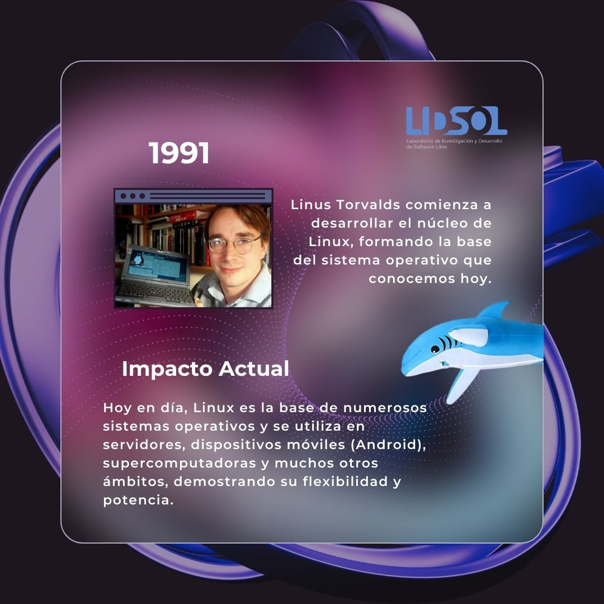

Hello, welcome to today’s capsule.

In this one, we will remember the past of Linux and how it revolutionized technology in more than one aspect.

## A bit of history...

### 1969 - The Emergence of Unix

Some years ago, in the state of New Jersey, home of the boardwalks in Atlantic City, soft pretzels, and water ice. At Bell Laboratories, Ken Thompson was involved in the development of an operating system called Multics.

Multics (Multiplexed Information and Computing Service) was one of the FIRST operating systems, conceived as a commercial product of General Electric. Although it did not achieve great success when implementing a single-level storage system for data access, it was essential in generating new ideas.

Thus, in 1969, together with Dennis Ritchie, they developed the UNIX operating system, rewritten in C for greater portability. Originally called Unics ("UNIplexed Information and Computing Service") in reference to Multics ("MULTIplexed Computer and Information Service"), it aimed to be friendly, flexible, and above all, without limits.

### 1983 - GNU is Not UNIX

This is how Richard Stallman started the GNU() project in 1983, whose goal was to create a completely free operating system that was not Unix.

GNU had a solid foundation, but the "Hurd" kernel was never finished, paving the way for the development of other kernels.

### Importance of the Kernel

The core of any operating system is the kernel, and it is the medium through which hardware and software communicate. BSD and Minix were early Unix systems, but neither had a unified and robust kernel that would make them legitimate substitutes.

### 1991 - The Birth of Linux

Linus Torvalds was a Finnish student who, in 1991, began working on the Linux kernel. What truly started as a small project quickly caught the attention of many people within the global developer community. The kernel was free software and laid the foundations of Linux.

### Change and Development

Linux has evolved from a simple operating system kernel into much more. It powers a wide variety of systems used in servers, mobile devices, supercomputers, and even aerospace missions.

