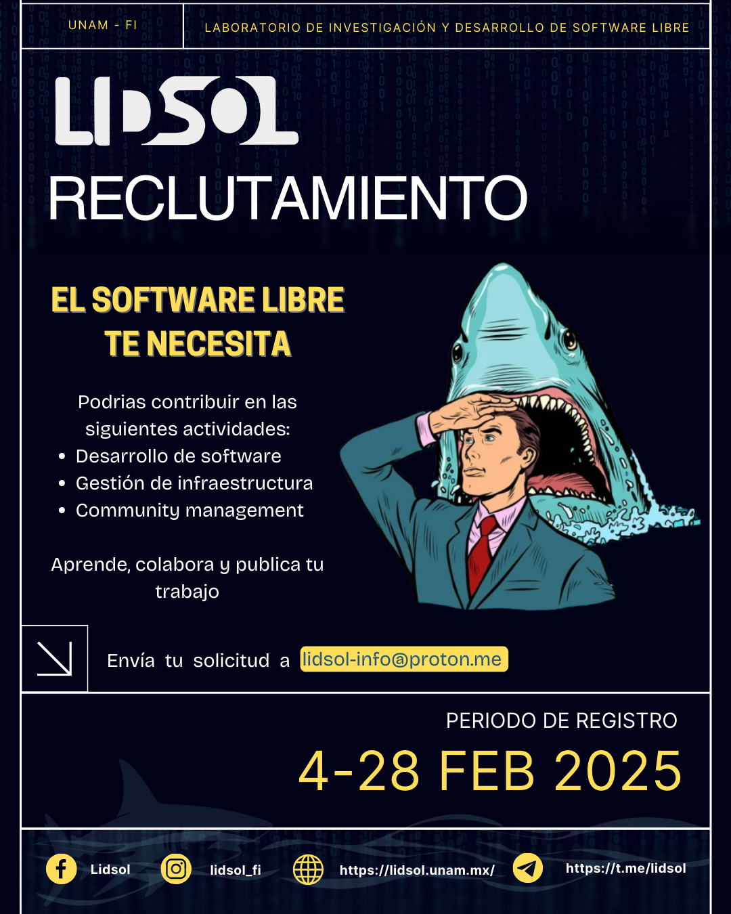

---
# Course title, summary, and position.
linktitle: LIDSOL UNAM Recruitment
summary: Join the Free Software Research and Development Laboratory 🚀

# Page metadata.
title: LIDSOL UNAM Recruitment
date: "2025/02/03"
lastmod: "2025-02-03"
draft: false
toc: true
type: docs

menu:
  lidsol:
    name: Call for Applications
    weight: 1
---

## 🚀 LIDSOL Recruitment

The **Free Software Research and Development Laboratory (LIDSOL) UNAM** is looking for students starting from their **second semester** to join our team. We are a group of students and engineers who aim to promote free software and provide development opportunities to UNAM students.

🔗 More info: http://lidsol.unam.mx

## 🔥 Benefits

✅ Contribute to software used by thousands of people.
  ◦ Choose your focus area: Software development and verification, infrastructure management and monitoring, community development and events.
  ◦ We collaborate on projects such as https://beam.apache.org, https://www.debian.org, https://archlinux.org, https://fedoraproject.org, https://www.drawdb.app and more.
✅ Receive mentorship from industry engineers from around the world.
✅ Connect with free software communities such as Apache, Fedora México, Red Hat, and GitHub.
✅ Build a portfolio for your job search.

## 📌 Program

Become part of one or more teams within the laboratory (software, infrastructure, or community). Create, develop, publish, and share your work.

We offer two modalities:

1️⃣ **Volunteer Program**: One semester with high flexibility (~8 hours per week).
2️⃣ **Social Service**: One to two semesters (~10–20 hours per week).
   - It is possible to use your laboratory work for your **thesis** (*consult with a professor*).

## 📍 Requirements

To apply, send the following information by email to lidsol-info@proton.me before **February 28, 2025**:

📌 **Personal information**: Full name, Student ID number, Cohort year, and Degree program.
📌 **Cover letter** (1–3 paragraphs) explaining:
   ◦ Why are you interested in being part of LIDSOL?
   ◦ Why do you think you are the right person to join?
   ◦ Convince us that you have the skills and/or determination to help us.
📌 **(Optional)** Portfolio or résumé: Show us your projects (even class projects), skills (Linux, Python, juggling, swimming, English), or previous experience.

## 📝 Selection Process

📩 **1. Submit your application** to lidsol-info@proton.me before **February 28, 2025**.
🗓️ **2. Interviews** from **March 3 to March 7, 2025**.
🎉 **3. Final invitations** on **March 9, 2025**.

📜 **Full details available at:** https://cloud.lidsol.unam.mx/s/siaz3jqeoKx6rBq

## 💬 Questions?

- Telegram: https://t.me/lidsol
- Email: lidsol-info@proton.me

#FreeSoftware #UNAM #LIDSOL #OpenSource #OpenCode

