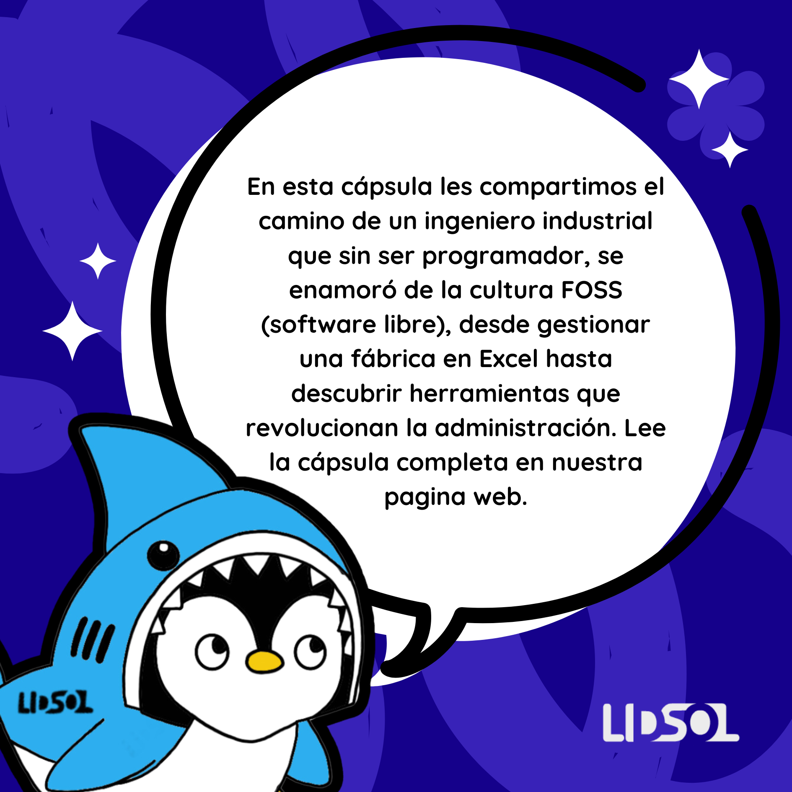

## Introduction

The LIDSoL team invited me to participate in the blog, and I thought it was a wonderful opportunity to share an experience from outside computer engineering or the strictly technical field. Although I am an Industrial Engineer, my entry into the software world was purely for practical reasons. In the process, I fell in love with the FLOSS / FREE culture and came to believe that it can be a path to help many organizations overcome the challenges inherent to entrepreneurial ventures. This is a bit of my story navigating these paths — a process that is also unfolding as I write.

## Engineering

Truth be told, the university where I studied Industrial Engineering is a very particular one. It was created in the 1960s in Lima, Peru by the major multinational companies of the time. Its main motivation was to supply middle and upper management to these companies — what is also known as the Professional-Managerial Class (PMC). Of course, I was completely unaware of this when I enrolled, and perhaps like many at that early age (just turning 17), I simply followed what my circle of friends wanted or was doing.

There was a lot I didn’t know, but I definitely did not see Engineering as a bridge between abstract and applied knowledge. Instead, I saw it (specifically Industrial Engineering at that particular university) as the mechanism to eventually become the owner of my own company or a high-level manager in a (very) large corporation. Let’s say the end justified the means, in a way.

Naturally, with that mindset, it’s hard to fully take advantage of such an interesting degree. What often happens is that you study for the exam, and in the end, you just want the “piece of paper” that proves you completed the process so you can move on to the next thing. It’s not an approach I would recommend, honestly, but it did leave me with several life experiences.

## Software

This brief preamble is meant to explain that in my professional life I always knew that tools existed to manage large operations using technology. MRP-I, MRP-II, which later evolved into ERPs for operations management — I used them in different jobs I had. I was unaware of CMSs, CRMs, and programming languages. I knew HTML existed and had programmed a bit in Visual Basic, which was not a very pleasant experience for me — I’m not entirely sure why, it was many, many years ago.

Life took its turns and led me to work in a cookie factory that began around 2007 as a small home workshop in a garage, with very little budget for anything beyond producing and selling. Administration, like in many startups, was handled in an Excel spreadsheet with a student license that, I remember, was sold at my university’s book fairs and came on a CD-ROM with the license code printed on the disc itself. Of course, this was (somewhat) illegal since I was no longer a student, but Peru is not exactly known for paying for licenses — everything was “cracked.” At the time, that felt like a slightly more honest approach.

Even in those very precarious entrepreneurial circumstances, I knew there were far more advanced systems that could save me a great deal of time managing and valuing inventories, invoicing, accounting accounts, accounts payable and receivable, financial reports, and countless other things that could be instantly available to help me understand how the venture was doing. I’ll tell you more about that in the upcoming posts…

