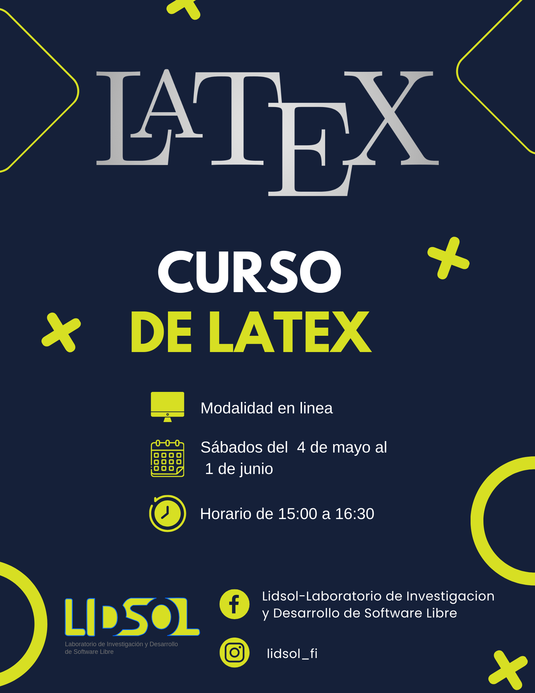

---
# Course title, summary, and position.
linktitle: Curso de LaTeX
summary: Acércate a LaTex para mejorar tus habilidades en composición tipográfica y creación de documentos científicos y académicos de manera profesional.

# Page metadata.
title: Curso de LaTeX
date: "2024-05-04T15:00:00Z"
lastmod: "2024-05-06T21:00:00Z"
draft: false  # Is this a draft? true/false
toc: true  # Show table of contents? true/false
type: docs  # Do not modify.

# Add menu entry to sidebar.
# - name: Declare this menu item as a parent with ID `name`.
# - weight: Position of link in menu.
menu:
  latex:
    name: Curso
    weight: 1
---

¡Aprende LaTeX desde la comodidad de tu hogar! 🖥️✨ Únete a nuestro curso virtual gratuito organizado por el Laboratorio de Investigación y Desarrollo de Software Libre (LIDSoL).

- 🗓️ Fecha: Todos los sábados del 4 de mayo al 1 de junio del año 2024
- 🕒 Horario: De 15:00 a 16:30 UTC-6
- 💻 Modalidad: Virtual, desde cualquier parte del mundo.
- 💰 Costo: ¡Totalmente gratis!

¿Quieres mejorar tus habilidades en composición tipográfica y creación de documentos científicos y académicos de manera profesional? ¡Este es el momento perfecto! Aprende LaTeX de la mano de expertos y potencia tu carrera en el ámbito académico y profesional.

No pierdas la oportunidad de dominar esta poderosa herramienta de edición de textos.

Las sesiones grabadas están disponibles en nuestro canal de YouTube.