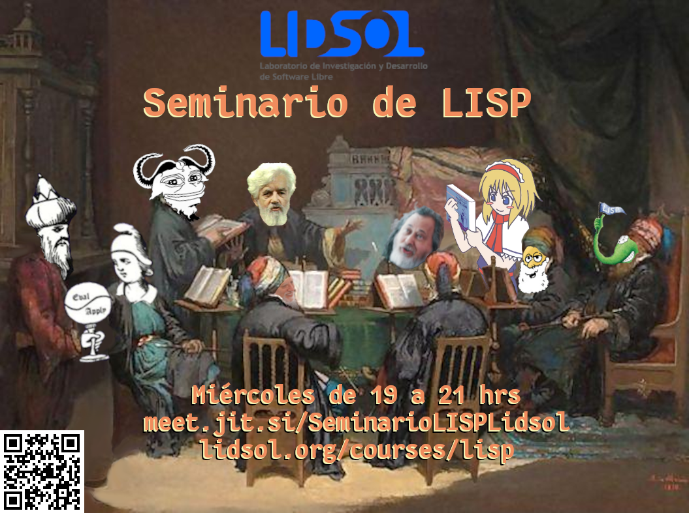

---
# Course title, summary, and position.
linktitle: Seminario de LISP
summary: Acércate a la programación funcional y a la computación con LISP :)

# Page metadata.
title: Seminario de LISP
date: "2020-06-01T19:00:00Z"
lastmod: "2020-06-02T22:59:00Z"
draft: false  # Is this a draft? true/false
toc: true  # Show table of contents? true/false
type: docs  # Do not modify.

# Add menu entry to sidebar.
# - name: Declare this menu item as a parent with ID `name`.
# - weight: Position of link in menu.
menu:
  lisp:
    name: Contenidos
    weight: 1
---

* **Miércoles: 19:00 - 21:00 *UTC-6* (CDMX)** revisamos capítulos del libro
[*Common Lisp: A Gentle introduction to Symbolic Computation*](https://gitlab.com/lidsol/seminario-lisp/-/blob/main/books/Common_Lisp_A_Gentle_Intro_to_Sym_Prog.pdf)

* **Sábados: 19:00 - 21:00 *UTC-6* (CDMX)** resolvemos ejercicios varios.

* Sala de Jitsi: https://meet.jit.si/SeminarioLISPLidsol
