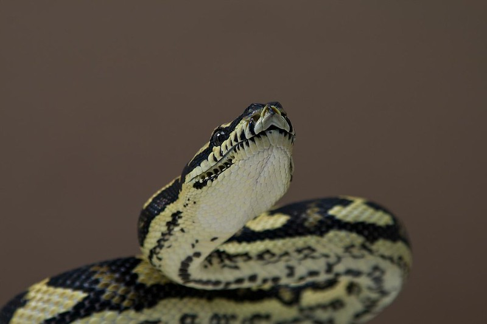

---
# Course title, summary, and position.
linktitle: Fundamentos de Python
summary: Curso de los fundamentos del lenguaje de programación python 🐍

# Page metadata.
title: Fundamentos de Python
date: "2020-06-23T12:00:00Z"
lastmod: "2020-06-23T12:59:00Z"
draft: false  # Is this a draft? true/false
toc: true  # Show table of contents? true/false
type: docs  # Do not modify.

# Add menu entry to sidebar.
# - name: Declare this menu item as a parent with ID `name`.
# - weight: Position of link in menu.
menu:
  python:
    name: Contenidos
    weight: 1
---

*Foto por: [Simon Foley](https://www.flickr.com/photos/16042949@N00/2307473952)*

## Resumen

Python es un lenguaje versátil y en constante crecimiento. En los últimos años
a mostrado una adopción explosiva que se refleja en el desarrollo de
inteligencia artificial, desarrollo web, manejo de grandes cantidades de datos,
entre otras. En este curso abundaremos en los elementos básicos del lenguaje
que servirán como cimientos para la elaboración de un proyecto que muestre la
rapidez de desarrollo, claridad del código y poder del lenguaje.

## ¿A quién va dirigido?

* El curso esta pensado y construido para personas sin conocimientos previos en
programación y con nociones elementales de computación. 

* Es adecuado para quienes quieran comenzar a programar ya que el lenguaje de
programación `python` es relativamente sencillo, con sintaxis clara,
ampliamente documentado y poderoso.

* Este curso no pretende ser exhaustivo, sin embargo, se busca abarcar los
fundamentos suficientes para iniciar en el mundo de la programación.

## Repositorio

* [Gitlab](https://gitlab.com/lidsol/intro-python)

## ¿Tienes alguna duda?

* Twitter: [@umoqnier](https://twitter.com/umoqnier)
* Correo: diegobarriga at protonmail.com

## Licenciamiento

Fundamentos de
Python por <a xmlns:cc="http://creativecommons.org/ns#" href="https://lidsol.org/" property="cc:attributionName" rel="cc:attributionURL">LIDSOL</a> se distribuye bajo una <a rel="license" href="http://creativecommons.org/licenses/by/4.0/">Licencia Creative Commons Atribución 4.0 Internacional</a>.

