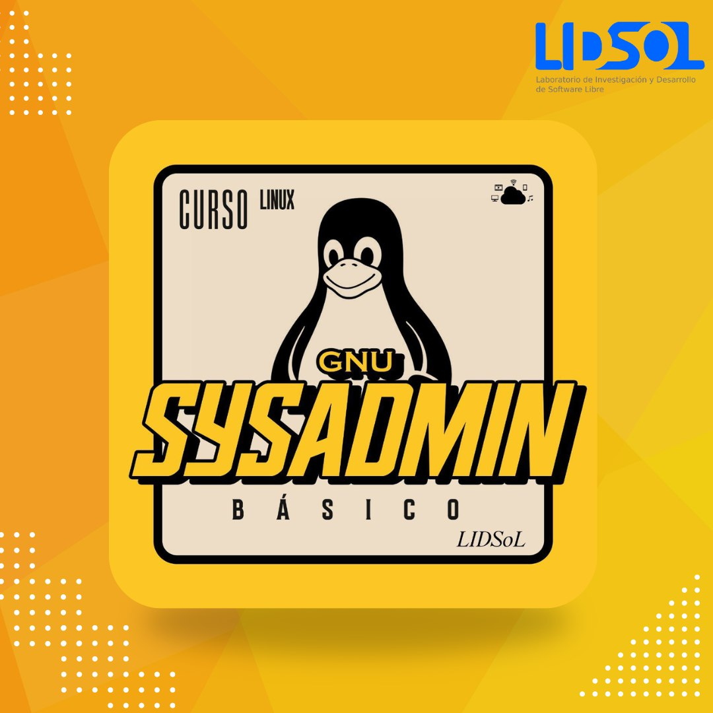

---
# Course title, summary, and position.
linktitle: Curso Básico de Sysadmin GNU/Linux
summary: Aprende a gestionar servidores GNU/Linux 🐧

# Page metadata.
title: Curso Basico de Sysadmin GNU/Linux
date: "2020-07-29T10:00:00Z"
lastmod: "2020-08-02T14:59:00Z"
draft: false  # Is this a draft? true/false
toc: true  # Show table of contents? true/false
type: docs  # Do not modify.

# Add menu entry to sidebar.
# - name: Declare this menu item as a parent with ID `name`.
# - weight: Position of link in menu.
menu:
  sysadmin:
    name: Cursos
    weight: 1
---

## Resumen

Un administrador de sistemas, conocido como sysadmin, es un profesional especializado en la gestión y mantenimiento de la infrestructura tecnologica de una organizacion.
Su trabajo consiste en configurar, mantener y asegurar servidores, redes y sistemas informaticos para que funcionen de manera eficiente y segura. 
Los sysadmin tambien se encargan de garantizar que los servicios tecnológicos estén disponibles y funcionando correctamente para los usuarios.
Además, gestionan la seguridad de la información, realizan copias de seguridad y resuelven problemas técnicos para asegurar que todo el sistema operativo de la organización sea confiable y efectivo.

## Aprende a ...

Gestionar servidores GNU/Linux! 🌟

✨ Únete a nuestro curso presencial organizado por el Laboratorio de Investigación y Desarrollo de Software Libre (LIDSOL).

- 🗓️ Fecha: Del 29 de julio al 2 de agosto del año 2024
- 🕒 Horario: De 10:00 a 14:00
- 🏫 Ubicación: UNAM - Facultad de Ingeniería - LIDSOL
- 💰 Costo: $600 para la comunidad UNAM, $1000 para el público en general

Mejora tus habilidades en administración de sistemas y gestión de servidores 
Aprendiendo GNU/Linux de la mano de expertos y potencia tu carrera en el ámbito profesional.

No pierdas la oportunidad de dominar esta importante herramienta de administración de sistemas.

[Inscríbete ahora](https://mmedia1.fi-b.unam.mx/)

## ¿Tienes alguna duda?

- Instagram: [@lidsol_fi](https://www.instagram.com/lidsol_fi/)
- Correo: [lidsol-info@proton.me](mailto:lidsol-info@proton.me)
