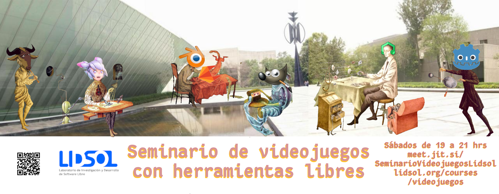

---
# Course title, summary, and position.
linktitle: Seminario de videojuegos con herramientas libres
summary: Grupo para explorar el diseño y desarrollo de videojuegos usando herramientas libres.

# Page metadata.
title: Seminario de videojuegos con herramientas libre
date: "2020-06-04T19:00:00Z"
lastmod: "2020-06-02T22:59:00Z"
draft: false  # Is this a draft? true/false
toc: true  # Show table of contents? true/false
type: docs  # Do not modify.

# Add menu entry to sidebar.
# - name: Declare this menu item as a parent with ID `name`.
# - weight: Position of link in menu.
menu:
  videojuegos:
    name: Contenidos
    weight: 1
---

Taller dedicado a aprender diseño y desarrollo de videojuegos usando
herramientas libres. Comenzaremos con programación de juegos con
Common LISP y dedicaremos la última sesión de cada mes a abordar temas
como música, motores libres, herramientas para creación de arte (*pixel
art*, *voxel art*, etc), narrativa y el concepto de juego.
