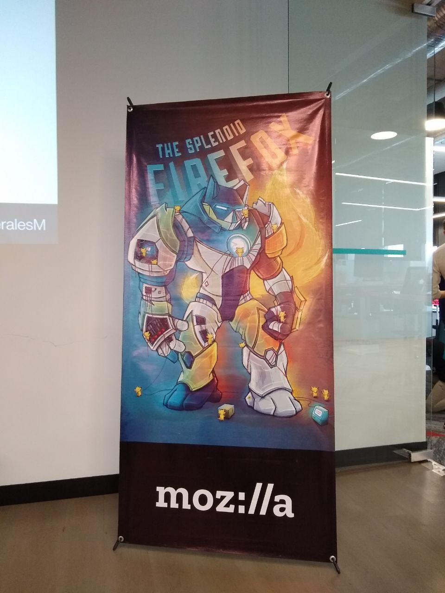
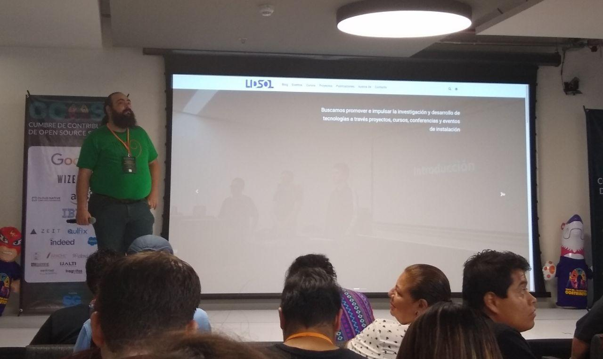
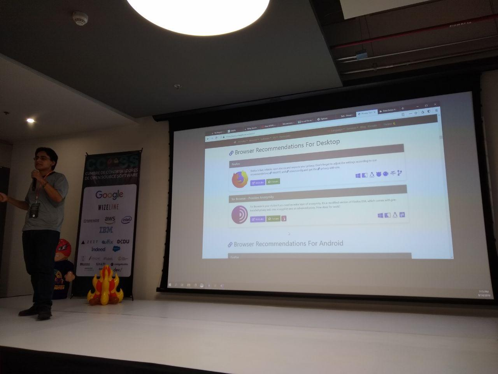

El equipo de LIDSOL tuvo la oportunidad de ser parte de la Cumbre de
Contribuidores de Open Source Software (CCOSS) que se llevó acabo en
Guadalajara, Jalisco el 14 a 15 de Septiembre. En esta entrada
queremos contarles las vivencias, experiencias, aprendizajes, dimes y diretes.

## ¿Qué es el COSS? 

El CCOSS es un evento que se enfoca en resolver el problema de las 
contribuciones a proyectos open source. A pesar de que el uso de open source es
[basto en América
Latina](https://hipertextual.com/2015/04/politicas-de-software-libre-en-latinoamerica),
las contribuciones son mínimas. Para ello, se han dado a la tarea de juntar
a una gran cantidad de comunidades de open source y
software libre que se encuentran alrededor del país.

Entre los organizadores se encuentra gente de *[Software
Guru](https://sg.com.mx/)*, *Google*,
*Wizeland*, *Helix Re* y el *[Laboratorio de Software Libre de
Zacatecas](https://cozcyt.gob.mx/labsol/)*. Con lo anterior, ya nos damos una
idea de lo grande que fue el evento. Hubo un
ambiente enriquecedor para el desarrollo del open source y el software libre
en México. Notamos gustosos la presencia de muches estudiantes universitaries
interesados en el tema y eso nos parece fabuloso.

En LIDSOL creemos que una parte fundamental del ecosistema son las
comunidades y la sangre joven siempre le viene bien al medio. Sobre todo,
cuando existe un rezago importante en el desarrollo de tecnologías con dichas
ideologías en toda América Latina.

Como se mencionó, el evento constó de dos días. El primero fue enteramente
dedicado a charlas por parte de personas que contribuyen activamente a 
proyectos de los cuales rescatamos la presencia de Federíco Mena (Cofundador
del projecto GNOME), Andréa Gómez (Go y Cloud developer), Jacóbo Najera (May
First Movement Technology) y Alejandro Calleja (Red Hat) por mencionar algunos.

## Presencia de LIDSOL en el CCOSS

Asistimos a diversas charlas donde se tocaban temas de suma importancia como
la diferencia entre open source y software libre, los proyectos que se llevan
a cabo en diversas instituciones, [la red Tor en América
Latina](https://www.youtube.com/watch?v=EHp-BNL7UnE), la economía del open
source, desarrollo de robots inteligentes con ROS y AWS y
el estado del open source en América Latína. Además, Gunnar Wolf habló del
laboratorio en las charlas inaugurales donde hablamos brevemente de los
proyectos que estamos desarrollando. 

Por ejemplo, el proyecto sobre mecanismos de privacidad y anonimato, el avance
en la gestión del capítulo de la ACM en la UNAM, pasantes que elaboran su tesis
en el laboratorio y los talleres pasado y futuros que los integrantes de LIDSOL
han impartido.

Fuimos parte del evento con la intención de conocer cual era el estado del
actual en temas de contribución, convivir gente que quisiera colaborar
y sobre todo a aprender cosas nuevas. Por ello fuimos participes de varios
talleres impartidos. Los talleres mencionados son CPython, Tensorflow, Firefox
y GNOME.

Por otra parte, tuvimos la oportunidad de extender la agenda del primer día
abriendo un panel de privacidad y anonimato. En este, expusimos la importancia
de la privacidad, funcionamiento de la red TOR y consejos generales para una
vida digital más saludable. 

## ¿Qué aprendimos?

Acudimos a los talleres del segundo día en donde nos orientaron para poder
realizar contribuciones a diferentes proyectos de software y, sobre todo, nos
ayudaron a superar el miedo a subir nuestro primer
*[pull request](https://help.github.com/en/articles/about-pull-requests)*.
Debido a que el público estaba compuesto por estudiantes, académicos y gente de
diversas industrias en la mayoría de los talleres se vieron con conceptos
elementales, como el uso de terminal, [GitHub](https://github.com/), para
obtener los proyectos, y [git](https://git-scm.com/) para poder contribuir como
se hace actualmente.

A continuación compartimos un vistazo general del taller de `CPython` que fue
uno de los que pudimos tomar. Además, dejamos la lista de los talleres a los
que asistimos como laboratorio. Si quieres profundizar en alguna herramienta
puedes acercarte a nosotrxs.

### Lista de talleres

* GNOME
* Firefox
* Tensorflow

### CPython

El taller comenzó con unos cuantos prerequisitos desde el día anterior. Los
organizadores recomendaron obtener el código fuente de `CPython` que se
encuentra oficialmente en un
[repositorio de github](https://github.com/python/cpython). Para poder bajarlo
se requieren conocimientos básicos de la herramienta
[git](https://git-scm.com/). Avanzando y ya con el código fuente dimos
un vistazo a la estructura de carpetas que compone el proyecto y posteriormente
pasamos a compilar el fuente para crear nuestro propio ejecutable. 

Nos orientaron para saber cual es camino más amigable para comenzar a
contribuir en el código fuente de `CPython`. También se comentó que no es necesario
ser desarrolladora para poder contribur. Siempre hay `issues` relacionados con
documentación, localización (traducción) y de diversos tópicos que no necesariamente
requieren de un perfil técnico.

Por último, vimos diferentes tipos de necesidades para el proyecto en su [página
de contribución](https://bugs.python.org/) para posteriormente realizar alguna
modificación al código fuente y mandar nuestro *pull request :D*

## Conclusiones

Sin duda hemos adquirido una experiencia enriquecedora en este evento dada la
diversidad de visiones, contextos y personas con las que nos pudimos relacionar. 
Para el laboratorio fue una gran oportunidad de compartir con la comunidad del
CCOSS el trabajo que realizamos y, por otra parte, es importante para nosotrxs
compartir con ustedes todo el conocimiento adquirido.

Queremos remarcar que si están interesadxs en contribur a algún proyecto
mencionado con anterioridad o cualquier otro proyecto open source o de sostware
libre se pueden acercar al LIDSOL. **¡¡¡Aquí podemos ayudarles!!!**
