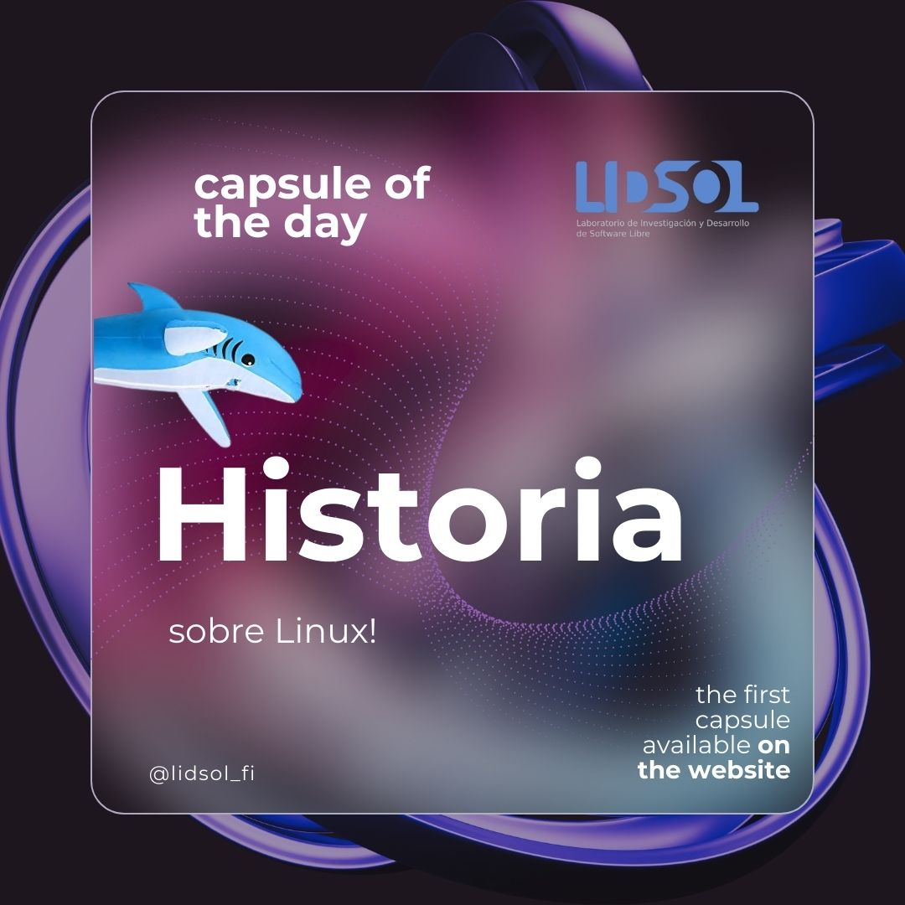
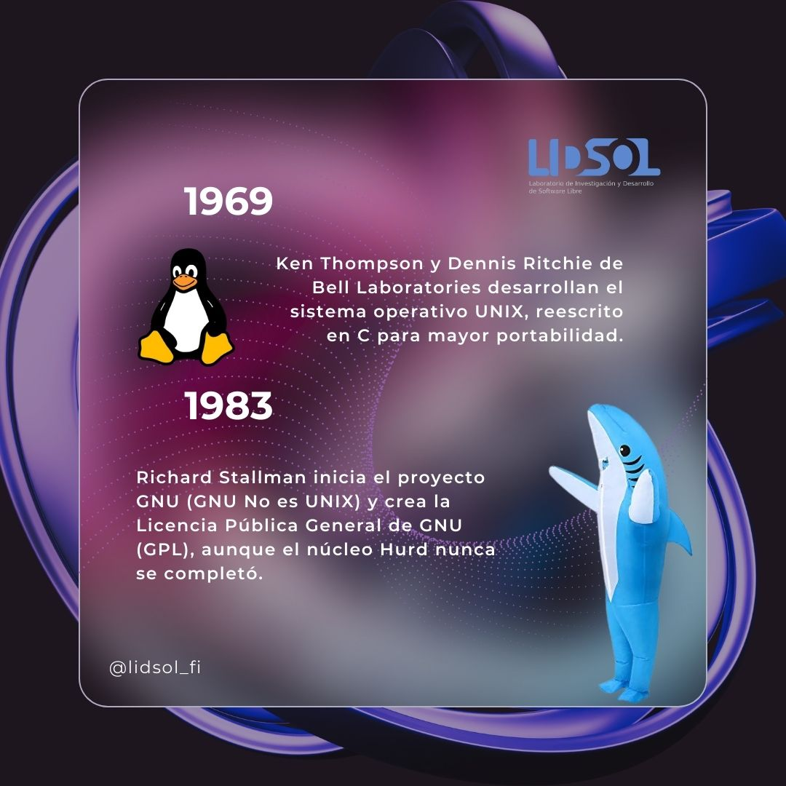
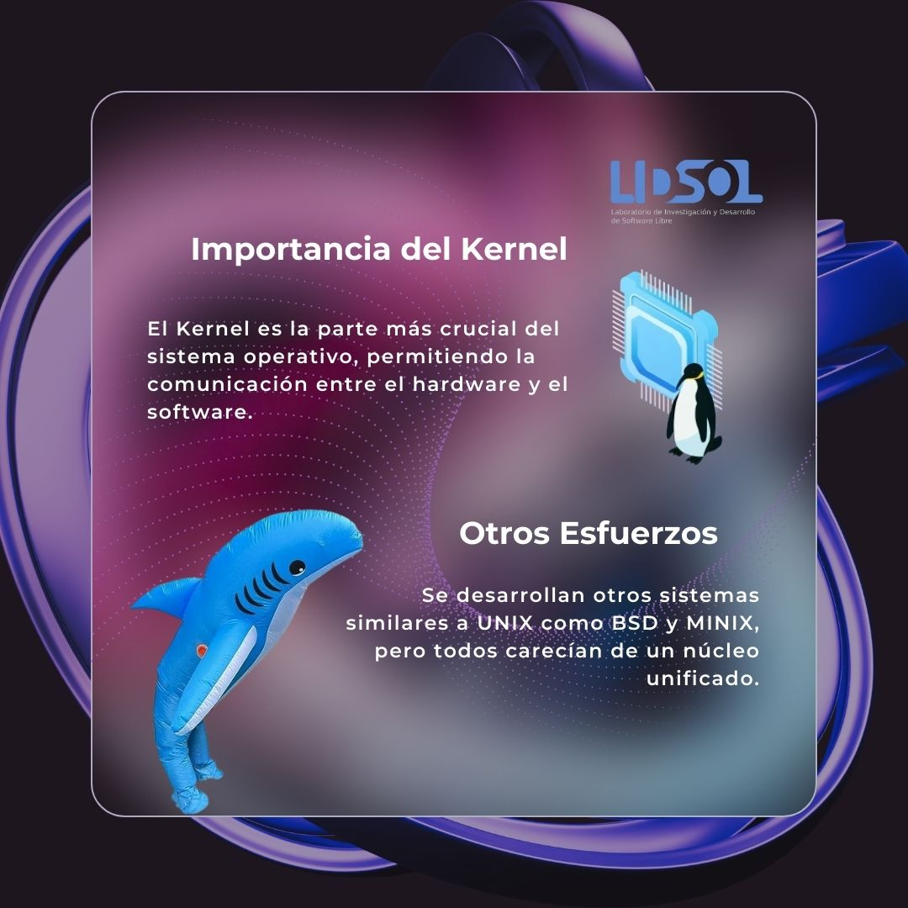
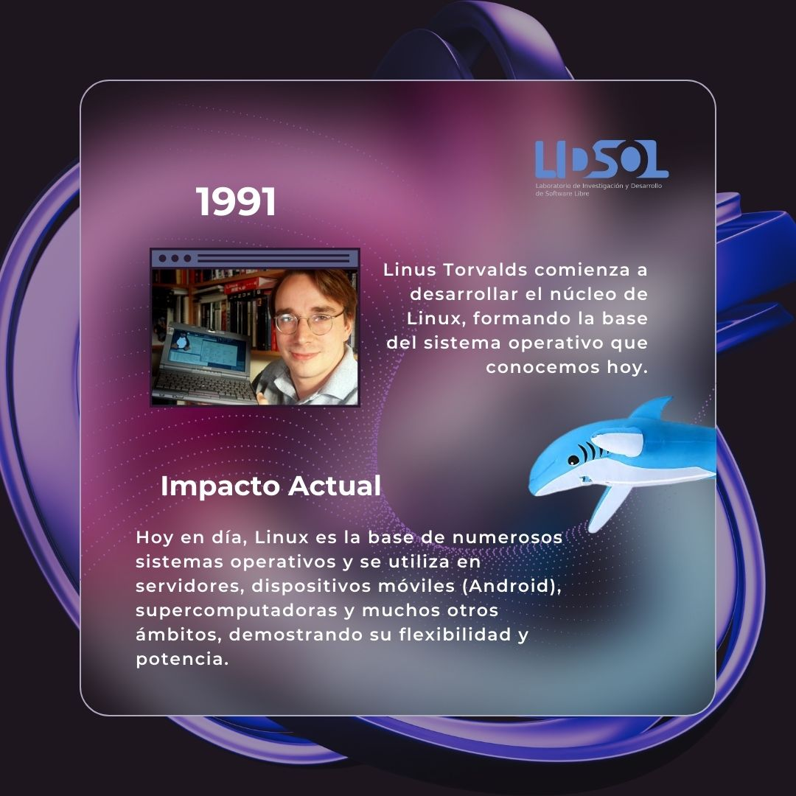

Hola, Bienvenidos a la capsula del dia.

En esta recordaremos el pasado de Linux y como revoluciono la tecnologia en mas de un aspecto. 

## Un poco de historia...

### 1969 - Surgimiendo de Unix

Hace unos ayeres, en el estado de New Jersey casa de los paseos maritimos en Atlantic City,pretzels blandos y helados de agua. En los Laboratios Bell se encontraba Ken Thompson, quien estaba involucrado en el desarrollo de un sistema operativo llamado Multics. 

Multics (Multiplexed Information and Computing Service) fue uno de los PRIMEROS sistemas operativos, el cual fue concebido como producto comercial de General Electrics, y aunque no tuvo un gran exito al implementar un unico nivel de almacenamiento para el acceso de datos, fue escencial para generar nuevas ideas.

Asi en 1969 junto Dennis Ritchie desarrollan el sistema operativo UNIX, reescrito en C para mayor portabilidad, originalmente Unics "UNIplexed information and Computing Service" en referencia a Multics "MULTIplexed Computer and Information Service", este buscaba ser ameno, flexible y sobre todo no poner limites.

### 1983 - GNU No es UNIX

Asi es como Richard Stallman inicio en 1983 el proyecto GNU(); cuyo objetivo era crear un sistema operativo completamente libre, que no fuera Unix.
GNU tenia una una base solida pero el  nucleo "Hurd" nunca se finalizo, allando el camino para el desarrollo de otros kernels.

### Importancia del Kernel

El núcleo de cualquier sustema operativo es el kernel y es el medio por donde se comunica el hardware y el software. BSD y Minx fueron los primeros sistemas Unix pero ninguno tenia un nucleo unificado y resistente que los convirtiera en sustitutos legitimos.

### 1991 - Asi surgue Linux

Linus Torvalds fue un estudiante Finlandés y por 1991 comenzo a trabajar en el nucleo de Linux. Que realmente al inicio fue un proyecto pequeño, pero rapidamente llamo la atencion de muchas personas dentro de la comunidad global de desarrolladores. Kernel era un sistema operativo libre y sento las bases de Linux

### El cambio y el desarrollo

Linux ha evolucionado desde un simple núcleo de sistema operativo a algo mas. Es la variedad de sistemas operativos utilizados en servidores, dispositivos moviles, supercomputadoras, misiones aeroespaciales.

