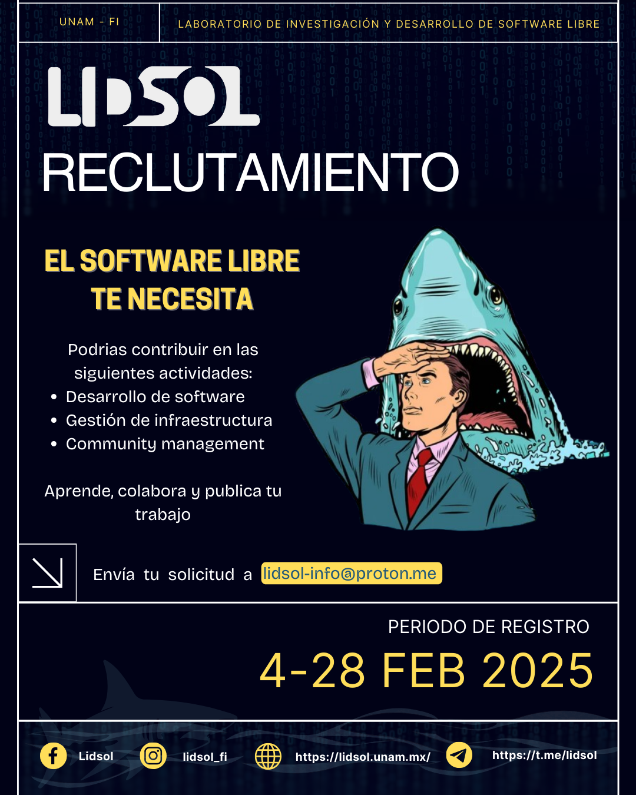

---
# Course title, summary, and position.
linktitle: Reclutamiento LIDSOL UNAM
summary: Únete al Laboratorio de Investigación y Desarrollo de Software Libre 🚀

# Page metadata.
title: Reclutamiento LIDSOL UNAM
date: "2025-02-03T10:00:00Z"
lastmod: "2025-02-03T14:59:00Z"
draft: false  # Is this a draft? true/false
toc: true  # Show table of contents? true/false
type: docs  # Do not modify.

# Add menu entry to sidebar.
# - name: Declare this menu item as a parent with ID `name`.
# - weight: Position of link in menu.
menu:
  lidsol:
    name: Convocatoria
    weight: 1
---

## 🚀 Reclutamiento LIDSOL

El **Laboratorio de Investigación y Desarrollo de Software Libre (LIDSOL) UNAM** está buscando estudiantes desde **segundo semestre** para unirse a nuestro equipo. Somos un equipo de estudiantes e ingenieros que busca promover el software libre y dar oportunidades de desarrollo a estudiantes de la UNAM.  

🔗 Más info: [lidsol.unam.mx](http://lidsol.unam.mx)  

## 🔥 Beneficios

✅ Participa desarrollando software utilizado por miles de personas.  
  ◦ Escoge tu área de enfoque: Desarrollo y verificación de software, manejo y monitoreo de infraestructura, desarrollo de comunidades y eventos.  
  ◦ Trabajamos con proyectos como [beam.apache.org](https://beam.apache.org), [debian.org](https://www.debian.org), [archlinux.org](https://archlinux.org), [fedoraproject.org](https://fedoraproject.org), [drawdb.app](https://www.drawdb.app) y más.  
✅ Recibe mentoría de ingenieros en la industria y de todo el mundo.  
✅ Conéctate con comunidades de software libre como **Apache, Fedora México, Red Hat y GitHub**.  
✅ Crea un portafolio para tu búsqueda de trabajo.  

## 📌 Programa

Forma parte de uno o varios de los equipos dentro de los laboratorios (software, infraestructura o comunidad). Crea, desarrolla, publica y comparte tu trabajo.  

Contamos con dos modalidades:  
1️⃣ **Voluntariado**: Un semestre con alta flexibilidad (~8 horas a la semana).  
2️⃣ **Servicio social**: De uno a dos semestres (~10-20 horas a la semana).  
   - Es posible utilizar el trabajo del laboratorio para tu **tesis** (*consultar con un profesor*).  

## 📍 Requisitos

Para participar, envía la siguiente información por correo a [lidsol-info@proton.me](mailto:lidsol-info@proton.me) antes del **28 de febrero de 2025**:  

📌 **Información personal**: Nombre, No. de Cuenta, Generación y Carrera.  
📌 **Carta de presentación** (1-3 párrafos) explicando:  
   ◦ ¿Por qué te interesa ser parte de LIDSOL?  
   ◦ ¿Por qué crees que serías la persona correcta para unirte?  
   ◦ Convéncenos de que tienes las habilidades y/o la determinación para ayudarnos.  
📌 **(Opcional)** Portafolio o currículum: Muéstranos tus proyectos (incluso de clase), habilidades (Linux, Python, malabares, natación, inglés) o experiencia anterior.  

## 📝 Proceso de selección

📩 **1. Envía tu solicitud** a [lidsol-info@proton.me](mailto:lidsol-info@proton.me) antes del **28 de febrero de 2025**.  
🗓️ **2. Entrevistas** del **3 al 7 de marzo de 2025**.  
🎉 **3. Invitaciones finales** el **9 de marzo de 2025**.  

📜 **Consulta todas las bases aquí:** [cloud.lidsol.unam.mx/s/siaz3jqeoKx6rBq](https://cloud.lidsol.unam.mx/s/siaz3jqeoKx6rBq)  

## 💬 ¿Tienes dudas?

- [Telegram](https://t.me/lidsol)  
- Correo: [lidsol-info@proton.me](mailto:lidsol-info@proton.me)  

#SoftwareLibre #UNAM #LIDSOL #OpenSource #CódigoAbierto
