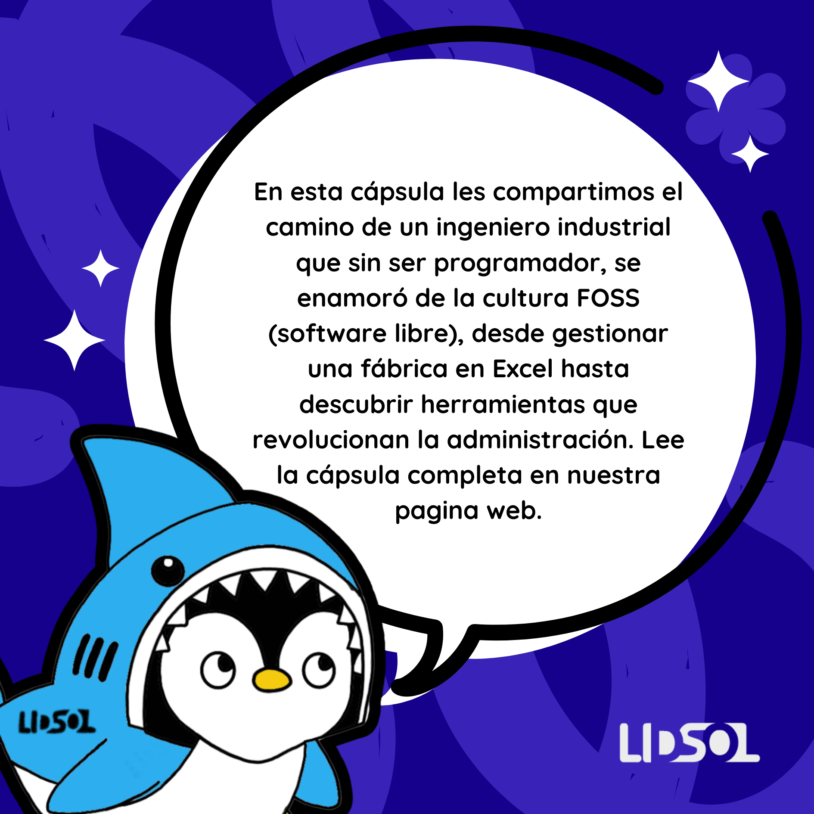

## Introducción

El equipo del LIDSoL me pidió participar en el blog y me pareció una hermosa oportunidad de compartir una experiencia desde fuera de la ingeniería en computación o la parte técnica. Si bien soy Ingeniero (Industrial) mi incursión en el mundo del software fue por motivos puramente utilitarios enamorándome en el proceso de la cultura FLOSS / LIBRE y creyendo que puede ser un camino para ayudar a muchas organizaciones a superar los problemas inherentes a los emprendimientos. Esta es un poco mi historia navegando estos surcos y un proceso que sucede también mientras se escribe.

## Ingeniería

Verdades sean dichas, donde estudié la carrera de Ingeniería Industrial es una universidad muy particular creada en los 60s en Lima, Perú por las principales empresas transnacionales del momento. Su principal motivación era de dotar de mandos medios y altos a estas empresas lo que también se conoce como Clase Administrativa Profesional o PMC por sus siglas en inglés. Por supuesto esto era totalmente desconocido por mí al momento de inscribirme y, quizás como muchos a esas edades tan tempranas (recién comenzados los 17), seguía lo que mi círculo amical deseaba/hacía.

Los desconocimientos eran muchos, pero definitivamente no veía a la Ingeniería como un vector entre el conocimiento abstracto y el aplicado sino más bien como el mecanismo (específicamente I. Industrial y en la Universidad en cuestión) para terminar siendo el dueño de mi empresa o un alto gerente en una empresa (muy) grande. Digamos que el fin justificaba los medios por ponerlo de alguna manera.

Lógicamente, con este acercamiento, es difícil poderle sacar el jugo a una carrera tan interesante y muchas veces lo que termina pasando es que se estudia para el examen y finalmente se quiere tener un ‘cartón’ que permite demostrar que se cumplió el trámite y ahora podemos seguir a lo próximo. No es un acercamiento que recomiende la verdad, pero sí me dejó varias experiencias de vida.

## Software

Este breve preámbulo es para dar a conocer que en mi vida profesional siempre supe que existían las herramientas para administrar grandes operaciones utilizando tecnología. MRP-I, MRP-II y que luego mutaron a ERPs para la administración de operaciones además de usarlos en los distintos trabajos que tuve. Desconocía la existencia de CMS, CRM y de lenguajes de programación entendía que existía HTML y había programado algo en Visual Basic lo que no fue una experiencia muy agradable para mí no sé bien por qué, fue hace muuuuuchos años.

Las vueltas de la vida me llevaron a trabajar en una fábrica de galletas que empezó por los 2007 como un breve taller casero en la cochera de una casa y sin mucho presupuesto para nada que no sea producir y vender. La administración, como muchos emprendimientos, se llevaba en un excel con licencia de estudiante que recuerdo vendían en las ferias del libro de mi universidad y venían en un CD-ROM con el código de la licencia impreso en el mismo objeto. Por supuesto esto era (medio) ilegal ya que yo ya no era estudiante, pero el Perú no es muy dado a pagar por licencias y todo se ‘crackeaba’. Me parecía una forma de ser un poco más honesto en ese momento.

Pero aún en estas circunstancias tan precarias de emprendimiento yo sabía que existían sistemas muchos más avanzados que me ahorrarían mucho tiempo en el manejo y valorización de inventarios, facturaciones, cuentas contables, carteras de pagos y cobranzas, reportes financieros y un sin fin de cosas que podían estar al instante y ayudarme a saber cómo iba el emprendimiento. De esto les iré contando en los siguientes posteos…

