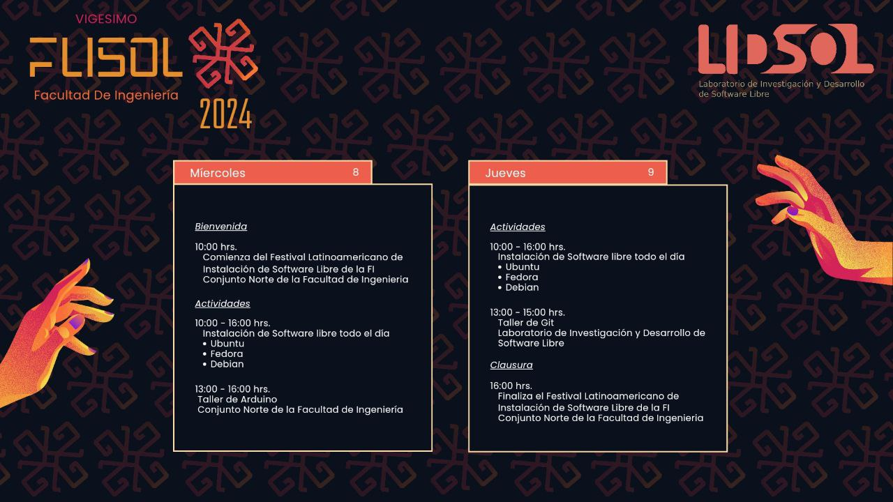

## ¿Qué es FLISoL?

El FLISoL es el evento de difusión de Software Libre más grande en Latinoamérica se realiza desde el año 2005 y desde el 2008 se adoptó su realización el 4to sábado de Abril de cada año.

Su principal objetivo es promover el uso del software libre, dando a conocer al público en general su filosofía, alcances, avances y desarrollo.

El evento es organizado por las diversas comunidades locales de Software Libre y se desarrolla simultáneamente con eventos en los que se instala, de manera gratuita y totalmente legal, software libre en las computadoras que llevan los asistentes.
Además, en forma paralela, se ofrecen charlas, ponencias y talleres, sobre temáticas locales, nacionales y latinoamericanas en torno al Software Libre, en toda su gama de expresiones: artística, académica, empresarial y social.

## ¿Donde es?

El evento se llevará a cabo los días 08 y 09 de Mayo de 2024 en el Conjunto Norte de la Facultad de Ingeniería en Ciudad Universitaria.

## ¿A quién está dirigido?

El FLISoL esta dirigido a todo tipo de público: estudiantes, académicos, empresarios, trabajadores, funcionarios públicos, entusiastas y aun personas que no poseen mucho conocimiento informático y desean encontrar nuevas formas de usar sus computadoras.

## ¿Qué habrá?

### Instalación de software libre

La actividad principal del evento es la instalación de software libre en las computadoras de los asistentes, así que si deseas probar algún software libre o instalar un sistema operativo libre puedes traer tu computadora y nosotros te ayudaremos a instalarlo.

### Conferencias

Los dos días que dura el evento habrán conferencias relacionadas con la adopción y uso del software libre en la industria, el gobierno y la academia.

Página oficial en el wiki de FLISoL

- <https://flisol.info/FLISOL2024/Mexico/CDMX/UNAM>

| Póster
|:-----:|
| 

| Charlas
|:-----:|
| 

## ¿Cómo participo?

### Conferencista

Si te gustaría dar una charla sobre software libre durante el evento puedes registrar una charla en [nuestro canal del **Telegram**][cfp-flisol].
[cfp-flisol]: https://t.me/LIDSoL

### Instalador

Si ya has usado software libre y sabes cómo instalar software en distintas plataformas, puedes asistir al evento y ayudar a otra persona a aprender a usar software libre.

### Asistente

La entrada al evento esta abierta a todo público y es gratuita.
Si deseas probar o instalar software libre trae tu equipo y nosotros te ayudamos.
Si deseas probar un nuevo sistema operativo realiza antes un respaldo de tu información.
